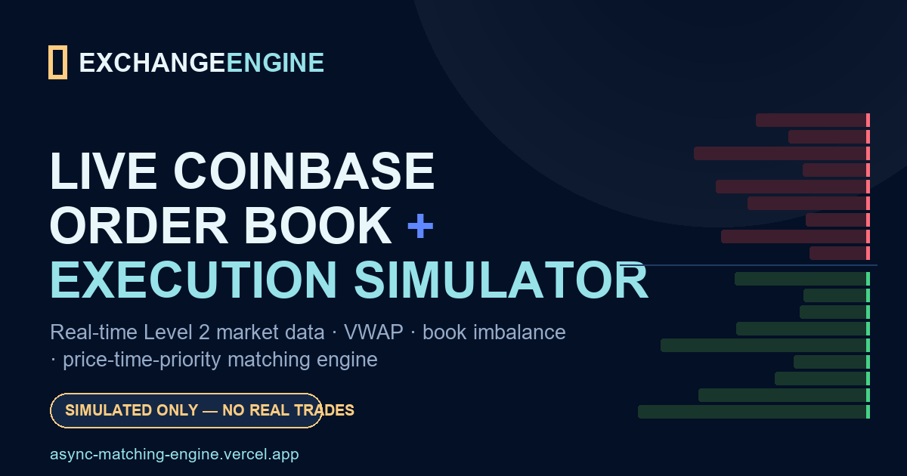

# exchange-engine


Real-time limit order book, matching engine, and microstructure analytics on
**live Coinbase Advanced Trade** market data — no API key or authentication.

**▶ Live demo: https://async-matching-engine.vercel.app/** (streams live BTC &
ETH data straight to your browser; some corporate networks block WebSockets, so
the page offers a clearly-labelled **sample-data** fallback.)



## What it does

Watching a real exchange feed, `exchange-engine` maintains an in-memory
price-time-priority order book, computes liquidity metrics (spread, mid, VWAP,
book imbalance, aggressive-flow imbalance), and lets you estimate how a
hypothetical order would fill against the current book. It ships as a Python
package (the precision implementation) plus a static browser dashboard.

> No real trades are ever placed. The project is public-data-only and
> simulation-only.

## Two implementations, one design

The repo contains a Python engine; the deployed page is a **separate static
browser mirror**. They are intentionally distinct — Vercel serves the static
page and does **not** run the Python engine.

```
Python package (precision)                    Static browser demo (this site)
──────────────────────────                    ───────────────────────────────
Coinbase WS → feed.py → book mirror           Coinbase WS → app.js → per-product
      → metrics.py → Rich dashboard                 book → metrics → DOM
synthetic orders → engine.py (OrderBook)      hypothetical order → core.mjs
      → fills / P&L / FastAPI                        → estimated fills / P&L
```

- **Python** uses `decimal.Decimal` for every price and quantity — exact.
- **Browser** uses IEEE `Number` for its estimates (explicitly labelled as such);
  raw Coinbase strings drive display where identity matters. The Python engine is
  the reference for precision.

## Correctness choices (Coinbase specifics)

- Public endpoint `wss://advanced-trade-ws.coinbase.com`; one subscribe frame
  **per channel** (`level2`, `market_trades`, `heartbeats`).
- Level 2 replies arrive on channel `l2_data`; sides are `bid`/`offer` with
  `offer` mapped to the ask side.
- `new_quantity` is the **absolute** level quantity (not a delta); `0` removes
  the level. Snapshots clear and rebuild the product book.
- `market_trades.side` is the **maker** side. The browser converts it to the
  **aggressor** side for display and flow metrics (aggressive buys green,
  aggressive sells red).
- Heartbeats keep the socket alive and drive feed-health signals; the feed
  reconnects with exponential backoff (2s → 30s).

## Project layout

```
src/exchange_engine/   models · orderbook · feed · engine · dashboard · metrics
tests/                 pytest: orderbook, metrics, engine, feed, models, api
tests/frontend/        node:test for the browser core logic
scripts/               benchmark.py (100k orders) · replay.py (offline)
public/                static Vercel dashboard (index.html, css, js/*.mjs)
api/index.py           optional Vercel Python serverless order simulator
```

## Install

```bash
python -m venv .venv && source .venv/bin/activate   # Windows: .venv\Scripts\activate
pip install -e ".[dev]"
```

## Run

```bash
python -m exchange_engine.dashboard                 # Rich terminal dashboard
uvicorn exchange_engine.engine:app --port 8000      # FastAPI service
python -m exchange_engine.engine                    # stdin CLI: "BUY 64000 0.01 LIMIT"
python scripts/replay.py --steps 200                # offline synthetic feed
```

### API

| Method | Path       | Description                                      |
|--------|------------|--------------------------------------------------|
| GET    | `/health`  | Feed liveness + per-product readiness.           |
| POST   | `/order`   | Submit a synthetic order; returns fills + P&L.   |
| GET    | `/book`    | Top-N bid/ask levels from the live feed mirror.  |
| GET    | `/trades`  | Recent trades from the feed.                     |
| GET    | `/metrics` | Spread, mid price, VWAP, imbalance.              |

```bash
curl -X POST localhost:8000/order -H 'content-type: application/json' \
  -d '{"side":"buy","price":"64000","quantity":"0.01","order_type":"limit"}'
```

## Tests

```bash
pytest                              # Python suite
node --test tests/frontend/core.test.mjs   # browser core logic
```

Measured on this machine (see environment below): **53 Python tests** and
**12 frontend tests** pass.

## Benchmark

```bash
python scripts/benchmark.py --orders 100000 --cancels 10000
```

Measured — Python 3.14.7, Windows 11, AMD Zen 3 (Ryzen), single core:

| Operation                | mean | p50 | p95 | p99 |
|--------------------------|-----:|----:|----:|----:|
| `add_order` (insert+match) | 7.98 µs | 5.70 µs | 16.90 µs | 25.00 µs |
| `cancel_order`             | 1.68 µs | 0.30 µs | 5.10 µs | 5.90 µs |

Median `add_order` is ~5.7 µs, comfortably under the 50 µs target. Numbers vary
by machine; re-run the command to reproduce on yours.

## Deploy (Vercel)

`public/` is fully static and connects to Coinbase directly from the browser, so
`vercel deploy` needs no configuration. `api/index.py` is an optional Python
serverless order simulator at `/api/order` (stateless; P&L lives only within a
warm instance).

## Known limitations

- The public demo **never places real orders** — it estimates immediate fills
  against currently-displayed liquidity and does not rest unfilled quantity as a
  live Coinbase order.
- Browser P&L is hypothetical mark-to-market in USD with **fees excluded**.
- Browser math uses IEEE `Number`; the Python package is the exact
  (`Decimal`) implementation.
- The serverless API is stateless, so its P&L does not persist across instances.

## Design decisions & tradeoffs

- **Static-first demo.** A persistent WebSocket can't run in a serverless
  function, so the live dashboard connects from the browser instead of proxying
  through the Python service. This keeps the demo reliable and free, at the cost
  of duplicating a little logic in JS (kept pure and unit-tested in `core.mjs`).
- **Separate feed mirror vs. simulation book.** The feed mirror reflects the
  real market; the engine's `OrderBook` is a distinct instance so synthetic
  orders never mutate the observed book.
- **`SortedDict` + `deque`.** O(log n) level access with FIFO time priority per
  level — simple, fast, and easy to reason about for a portfolio-scale engine.

## License

MIT — see [LICENSE](LICENSE).
